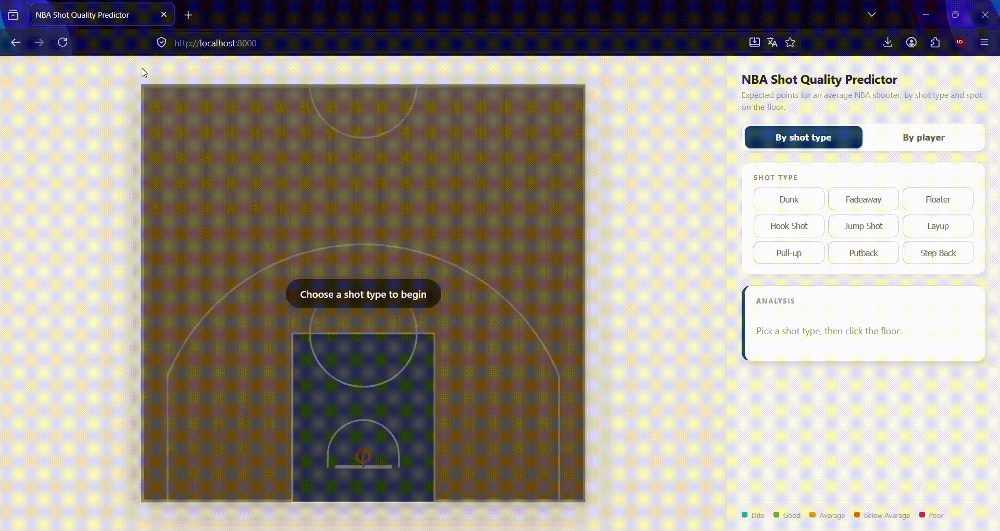
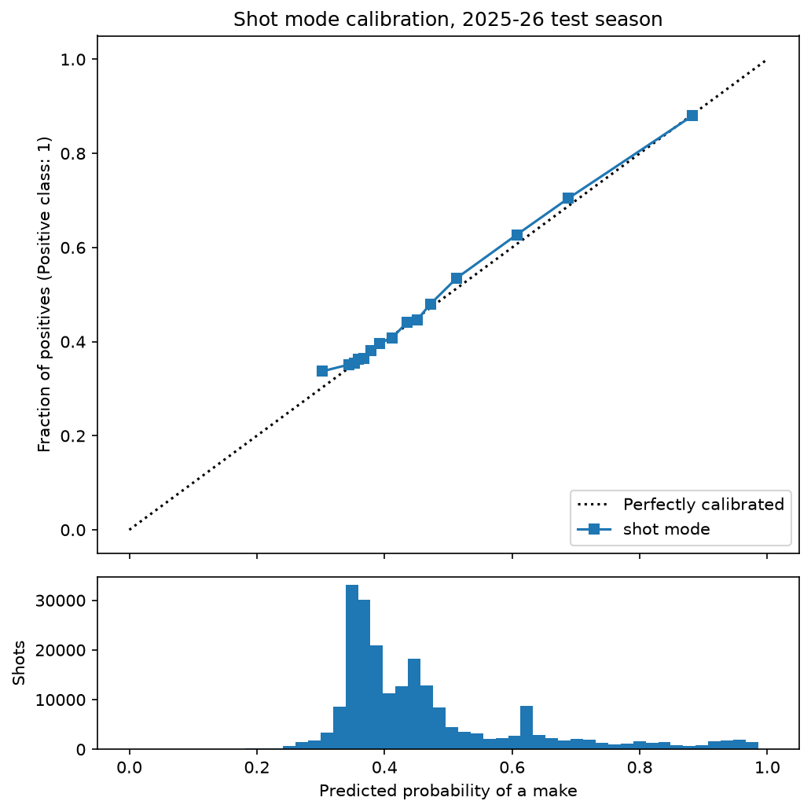
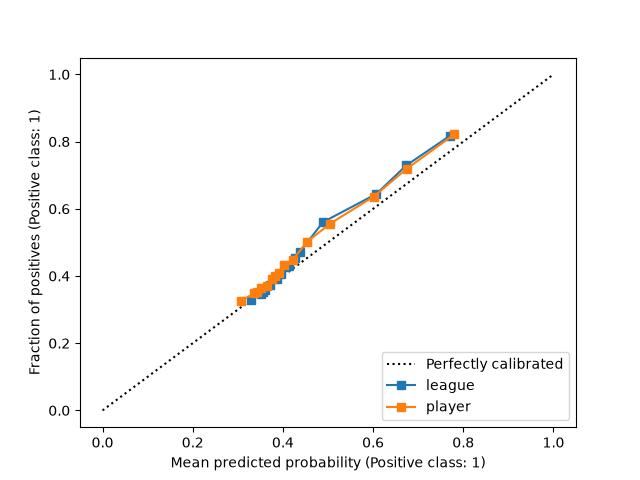

# NBA Shot Quality

Expected field-goal percentage and expected points for any spot on an NBA court, trained on 2.1M shots from ten seasons (2016-17 to 2025-26).

The idea came from SofaScore's xGoals feature, which puts a value on every football shot based on how likely it was to be scored. I wanted to see how far the same thing could be taken in basketball using only publicly available shot data.

**Shot mode** — pick a shot type (dunk, floater, step back, …), click a spot, and get the expected points and expected FG% for a league-average shooter attempting that shot from there. Only realistic combinations are clickable, for example a 20-foot layup is greyed out by the court.

**Player mode** — pick one of 362 players and get the expected FG% for the selected player and spot, alongside the league average and the gap between the two. A player is only selectable in zones where they have enough shot attempts for the model to return a meaningful and accurate response.



## Live Demo

The demo runs on a free Render instance, which is put to sleep after a period without visitors. If the page takes a while to appear, the container is starting up and loading the models, which takes around half a minute. Every visit after that is immediate.

**[Live demo](TODO)**

## Local Quickstart

The trained models are stored with Git LFS, so it needs to be installed before cloning or the model files arrive as small text placeholders and the container will fail to start.

```bash
git lfs install

git clone https://github.com/djurgec/shot-quality-model.git

docker compose up --build
```

Then open <http://localhost:8000>.


## Data

I pulled shot-level data from the NBA Stats API, where each row is a single attempt.

| split | seasons | shots | FG% |
|---|---|---|---|
| train | 2016-17 → 2022-23 | 1,451,864 | 46.4% |
| validation | 2023-24, 2024-25 | 437,544 | 47.1% |
| test | 2025-26 | 219,144 | 47.1% |

I split the data by season instead of randomly. With a random split, shots taken by the same player in the same season end up on both sides of the boundary, and the model can just memorise individual players, which inflates every metric. Splitting by season means the test set is the future relative to the training set.

Each shot is described by its coordinates on the floor, its distance from the rim, which of the five court zones it came from, and its type. The NBA records around 50 different shot descriptions, which are collapsed into 9 categories: dunk, layup, jump shot, pull-up, step back, fadeaway, floater, hook shot and putback. A movement flag is parsed out of the same description, so a "Running Dunk Shot" becomes a dunk taken on the move. Player mode adds the identity of the shooter, and merges the left and right corner into a single corner-three zone, since the two are mirror images and splitting them halves the sample in the sparsest zone on the floor.


## Models

All models are XGBoost classifiers. XGBoost is considered the industry standard for this type of tabular data due to its fast training speeds and the ability to achieve peak performance with minimal feature engineering.

Hyperparameters are tuned with Optuna over 50 trials per model, fitting on the training set and scoring on validation. Every trial is tracked in MLflow, and once the search finishes the best configuration is refit and saved.

I tuned on Brier score rather than cross-entropy or accuracy. The app shows a probability to the user, so how well calibrated that number is matters more than whether the model ranks shots correctly. Accuracy would be misleading here anyway, since a model that predicts a miss for every attempt scores 53%.

### Movement, and the contested shot problem

The largest factor determining whether a shot goes in is whether it was contested, and this dataset doesn't record that. Without it, an open and a heavily contested attempt from the same spot are identical rows.

The movement flag is a partial substitute. A layup off a cut or a dunk in transition usually comes out of an advantage situation, such as a backdoor cut or a blown rotation, while a set attempt is more often taken against a defender who is already in position. It does not measure contest directly, but it correlates with it and costs nothing to recover.

| category | set FG% | moving FG% | difference |
|---|---|---|---|
| Layup | 51.4% | 69.2% | +17.8 |
| Dunk | 86.2% | 93.8% | +7.6 |
| Jump Shot | 35.7% | 42.3% | +6.6 |

The remaining six categories are never recorded as moving at all, since the NBA does not describe something like a "running step back". So the toggle in the interface only shows up for dunks, layups and jump shots.

### Player mode: two models instead of one

Player mode runs two models and reports the difference between them. The first sees only location and zone, and predicts what an average NBA player shoots from a given spot. The second sees the same plus the identity of the shooter. The gap between the two is the player's edge over the league average at that exact spot.

A player needs 400 or more attempts in at least 2 zones to be selectable, and 200 or more in a zone for that zone to be clickable. 362 players qualify.

I also tested requiring a set number of attempts in 4 of the 5 zones, and rejected it. This type of threshold drops players who are specialists in some subset of the court, most often centres like Gobert, Zubac and Steven Adams, players who never take shot attempts outside of the paint.

Only shots from 2016-17 onward are counted, including for players whose careers began earlier. This is due to the NBA's 'Three-point revolution'; shot charts have changed drastically over the years, and modern offenses rely on the three-point shot significantly more than in the past.

### Quality bands

Player mode verdicts (elite, above average, average, below average, poor) come from percentiles of the difference between the two models, cut at 5/30/70/95. They are computed separately for each zone, because the zones aren't comparable to one another:

| zone | league FG% | elite threshold |
|---|---|---|
| Restricted Area | 63.8% | +7.0 |
| In The Paint (Non-RA) | 41.8% | +7.0 |
| Corner 3 | 38.7% | +5.5 |
| Mid-Range | 40.7% | +4.6 |
| Above the Break 3 | 35.3% | +4.3 |

The gap between the best and worst finishers at the rim is the widest on the floor, so it takes roughly 7 points over the league average to rank elite there, against 4 from beyond the arc. A single league-wide threshold would call too many players elite at the rim and almost nobody elite from three.

## Results

All figures are computed on the held-out 2025-26 season, which was used neither in training nor in tuning. Brier score is the metric the models were tuned on, and lower is better. The baseline model simply predicts the global average shooting percentage for every shot.

| model | Brier | AUC | accuracy |
|---|---|---|---|
| shot mode | 0.2265 | 0.652 | 62.8% |
| player mode | 0.2288 | 0.652 | — |
| league average | 0.2294 | 0.649 | — |
| baseline | 0.2492 | — | 52.9% |

### Comparison with published work

Most models that quantify shot-making probability are proprietary. The best known ones are commercial models whose training data and evaluation results are never published, so the three works below are among the few for which numbers are publicly available.

Both losses measure how far the predicted probability $p_i$ sits from the actual outcome $y_i$.

**Brier loss**, the mean squared difference between the two:

$$\frac{1}{N}\sum_{i=1}^{N}(p_i - y_i)^2$$

**Log loss**, also known as cross-entropy loss, which is unbounded and penalises confident mistakes more heavily:

$$-\frac{1}{N}\sum_{i=1}^{N}\left[y_i\log(p_i) + (1 - y_i)\log(1 - p_i)\right]$$

Accuracy is a poor evaluation metric for this model, because it simplifies a probability value into a yes or no classification at the 50% mark and gives away no information about how well calibrated that probability was. I included it anyway, since it is the only metric two of these three works report.

| model                         | Brier | log loss | accuracy |
|-------------------------------|---|---|---|
| This project                  | 0.2265 | 0.6424 | 62.8% |
| [Harmon et al. (2021)](https://arxiv.org/pdf/1609.04849)      | — | 0.649 | — |
| [Meehan (2017)](https://cs229.stanford.edu/proj2017/final-reports/5132133.pdf)             | — | — | 62.97% |
| [Kambhamettu et al. (2024)](https://dl.acm.org/doi/10.1145/3689061.3689068) | — | — | 81.8% |

Every one of these works uses a different season and a different dataset, so the table is indicative and not a ranking. Harmon et al. feed five seconds of movement for all ten players and the ball into a convolutional network, and end up with a log loss slightly worse than what this model reaches from shot location and type alone. Meehan classifies shots as made or missed with a boosting model, on a dataset that includes the distance to the closest defender, and finishes 0.17 percentage points ahead of the accuracy reported here. Kambhamettu et al. get to 81.8% with a recurrent network over ten seconds of tracking data, describing every player on the court by their distance to the shooter and to the basket at each second, plus season statistics for all ten players. None of those features are available or recoverable from the NBA's public shot-location data, so the gap between that model and this one is a measure of the data rather than of the algorithm.

### Calibration

A model is calibrated when its probabilities mean what they say: out of all the shots it rates at 40%, close to 40% should actually go in. That matters more than usual here, since the app shows that number to the user instead of using it internally, and a model can rank shots correctly while still being wrong about how likely they are. The plots below put predicted probability against the observed share of makes. A perfectly calibrated model follows the diagonal.






### Possible improvements

The biggest improvement would be adding defender distance, since the difference between an open and a contested shot outweighs everything else here and the movement flag is only a rough substitute. After that come the shot clock and game context, since a shot with two seconds left is most likely a far worse attempt than the same shot with fifteen. Both of these are data problems rather than modelling ones.


## Project structure

```
app/          FastAPI service (API, court geometry, feature definitions)
frontend/     index.html, app.js, style.css
shared/       JSON read by both the API and the browser
models/       trained XGBoost models
training/     data fetching, cleaning, tuning, evaluation
```
